<div align="center">

<pre>
██╗  ██╗███████╗███████╗████████╗ ██████╗ ███╗   ██╗  ───  ██████╗ ███████╗
██║  ██║██╔════╝██╔════╝╚══██╔══╝██╔═══██╗████╗  ██║  ───  ██╔═══██╗██╔════╝
███████║█████╗  ███████╗   ██║   ██║   ██║██╔██╗ ██║  ───  ██║   ██║█████╗
██╔══██║██╔══╝  ╚════██║   ██║   ██║   ██║██║╚██╗██║  ───  ██║▄▄ ██║██╔══╝
██║  ██║███████╗███████║   ██║   ╚██████╔╝██║ ╚████║  ───  ╚██████╔╝███████╗
╚═╝  ╚═╝╚══════╝╚══════╝   ╚═╝    ╚═════╝ ╚═╝  ╚═══╝  ───   ╚═══██║╚══════╝
                                                         ███████║
                                                         ╚══════╝
</pre>

# Heston / QE Systematic Research on NIFTY 50

*From efficient simulation to systematic signal — with every negative result reported.*

[](requirements.txt)
[](tests/)
[](#-the-pipeline)
[](reports/oos_evaluation.md)

</div>

---

> ### The one-paragraph verdict
> A Heston stochastic-volatility model with Andersen's Quadratic-Exponential simulator
> was calibrated, simulated, signalled, backtested and significance-tested on NIFTY 50
> data across **two independent blocks** — and the directional edge is a
> **replicated null** (hit rates ≈ coin flip, Brier skill ≤ 0, no rule beats buy-and-hold).
> What *did* survive: **volatility-distribution information** — 5-day model-vol forecasts
> correlate ~0.47 with realised volatility out-of-sample. The companion options-mispricing
> stack prices, detects and delta-hedges consistently on synthetic chains, but has never
> touched real market data. *This README documents the evidence; start with
> [`reports/oos_evaluation.md`](reports/oos_evaluation.md).*

---

## ━━━ The pipeline ━━━

```mermaid
flowchart LR
    A["📦 NIFTY + VIX + T-bill + Calendar<br/><i>Stage 2 · point-in-time ETL</i>"]
    B["🎛️ Heston calibration<br/>κ θ ε ρ V₀ · rolling GMM<br/><i>Stage 3</i>"]
    C["🎲 QE Monte Carlo<br/>ψ-branches · K0–K4 · martingale fix<br/><i>Stage 4 · 26/26 ✓</i>"]
    D["📡 Forecast distributions<br/>+ signals A–E<br/><i>Stage 5 · no PnL yet</i>"]
    E["⏱️ Walk-forward backtest<br/>t-close → t+1-open · costs<br/><i>Stage 6</i>"]
    F["⚖️ OOS test + significance<br/>Bonferroni α = 0.0071<br/><i>Stage 8</i>"]
    G["🧪 Options leg<br/>fair value → mispricing → hedge<br/><i>Stage O1 · synthetic</i>"]
    A --> B --> C --> D --> E --> F
    C --> G
    style F fill:#3a1414,stroke:#e5534b
    style C fill:#0f2c1c,stroke:#3fb950
```



<details>
<summary><b>Stage 1 — Research design</b> · question, hypotheses, blueprint</summary>

Pre-registered RQ (*"Can Heston/QE generate significant, economical NIFTY signals?"*),
H0/H1 plus volatility/direction/regime/Shapre sub-hypotheses, and the RQ-1 → RQ-2 → RQ-3
gating (predictive content → economic value → attribution). Profitability explicitly
*not* assumed.
</details>

<details>
<summary><b>Stage 2 — Data pipeline</b> · <code>data/</code> → <code>nifty_daily.parquet</code></summary>

Loader / cleaning / validation with a hard look-ahead audit
(`signal(t-close, data≤t) → trade ≥ t+1-open`), NSE calendar, 91D T-bill rate,
India VIX, frozen train/val/test splits. Evidence: `reports/data_quality.md`,
`reports/data_dictionary.md`.
</details>

<details>
<summary><b>Stage 3 — Calibration</b> · <code>calibration/</code> → rolling κ θ ε ρ V₀</summary>

Method-of-moments start + L-BFGS-B moment matching on trailing 504-day windows with
monthly vintages; Fourier (COS) pricer for the implied leg. Honest bias audit against
known synthetic truth (ε ~2.5× high, ρ washed out, Feller violated 100%).
Evidence: `reports/calibration_v1.md`, `reports/calibration_synthetic_assessment.md`.
</details>

<details>
<summary><b>Stage 4 — QE simulator</b> · <code>simulation/</code> → validated paths</summary>

Andersen §3 faithfully implemented (CIR moments, ψ-branching, trapezoidal
integrated variance, K-coefficients, MGF-based martingale correction) and checked
against three independent benchmarks: exact CIR non-central-χ² law, closed-form
moments, COS option prices. **26/26 checks pass.** Every formula tagged
`[ANDERSEN]` vs `[EXTENSION]`. Evidence: `reports/simulation_validation.md`.
</details>

<details>
<summary><b>Stage 5 — Signals</b> · <code>signals/</code> → 12 stats + signals A–E</summary>

PIT-hardened forecast engine (monthly recal, deterministic seeds, MC error bars).
Directional accuracy / precision / recall / Brier / forecast–realised correlation /
probability calibration computed **before any PnL**. Outcome: direction ≈ null,
volatility ≈ signal. Evidence: `reports/signal_diagnostics.md`.
</details>

<details>
<summary><b>Stage 6 — Backtest engine</b> · <code>backtest/</code> → exact accounting</summary>

Event engine (next-open execution, close-of-(t+h) exit, 5 bps + 2 bps slip),
identity-exact cost math (`net = gross − costs`, residual 0.00e+00), buy-and-hold
replication to 1e-10. Mechanics only — no strategy picked here.
Evidence: `reports/backtest_engine_validation.md`.
</details>

<details>
<summary><b>Stage 8 — OOS verdict</b> · <code>analysis/</code> → significance table</summary>

Six frozen rules + B&H on the untouched 2023–25 block: binomial hit-rates,
non-overlapping t-tests, bootstrap CIs, overlap-averaged Sharpe/alpha, null-shifted
paired Sharpe-diff bootstrap. Nothing beats B&H; Heston timers significantly lag it.
Evidence: `reports/oos_evaluation.md`.
</details>

<details>
<summary><b>Stage O1 — Options mispricing</b> · <code>options/</code> → synthetic proof</summary>

QE fair value → executable-terms detection (vs bid/ask, never mid-only) → CRN Greeks →
costed delta-hedge loop. Detection: 3/3 injected markups flagged, 0 false positives;
hedge loop closes in mean. Two real bugs caught en route (hedge-sign error, day-count
mismatch — now asserted invariants). Real chains gated: no bid/ask timestamps, no trading.
Evidence: `reports/options_mispricing.md`.
</details>

---

## ━━━ Scoreboard ━━━

|  | Claim tested | Result |
|--|--------------|--------|
| ✗ | Directional edge (hit rate, Brier, correlation) | Null on both blocks — accuracy at base rate, skill ≤ 0 |
| ✗ | Trichotomy LONG/SHORT strategy vs buy-and-hold | h1: zero coverage · h5: Sharpe −0.81, significantly worse |
| ✗ | Vol-filter rescues direction | Rejected — worsened mean/trade (−0.0023 vs −0.0016) |
| ✓ | Volatility-distribution information | Model-vol ↔ realised-vol corr **0.23 (1d) / 0.47 (5d)**, replicated OOS |
| ✓ | QE simulator correctness | 26/26 mathematical checks; CF≡Monte Carlo; COS≡Black-Scholes limit |
| ◐ | Options mispricing engine | Proves out on synthetic truth; **not cleared for real markets** (6 gating items) |

---

## ━━━ Run it ━━━

```bash
git clone <this-repo> && cd heston-nifty
pip install -r requirements.txt          # pandas · numpy · scipy · pyarrow · pytest …

# ── full pipeline, in dependency order ─────────────────────────────
python -m data.make_dataset --config configs/data_v1.yaml --demo        # ① data (offline demo)
python -m calibration.run_calibration --config configs/calibration_v1.yaml  # ② params
python -m simulation.run_validation                                     # ③ prove the simulator
python -m signals.run_signals --config configs/signals_v1.yaml          # ④ validation forecasts
python -m signals.run_signals --config configs/signals_oos.yaml         # ⑤ test forecasts (once!)
python -m backtest.validate_engine                                       # ⑥ prove the engine
python -m analysis.oos_evaluation                                       # ⑦ the verdict
python -m options.run_options_stage                                      # ⑧ synthetic options leg

python -m pytest tests/ -q                # 37/37 green or don't trust a number above
```

> ⚠️ **Demo-data notice.** Shipped artifacts are *synthetic* (seeded Heston-flavoured
> path, stamped `DEMO_SYNTHETIC`) so the whole pipeline runs offline. Real rerun needs
> `data/raw/`: NSE OHLC + holiday calendar, RBI 91D yields, India VIX — and timestamped
> bid/ask chains for the options leg. Frameworks transfer; numbers must be recomputed.

---

## ━━━ Map ━━━

```text
heston-nifty/
├── README.md                    ← you are here
├── configs/                     data_v1 · calibration_v1 · signals_v1 / _oos · backtest_v1
├── data/                        Stage 2 ETL ──► processed/nifty_daily.parquet
├── calibration/                 Stage 3 ──► rolling κθερV₀ + COS pricer
├── simulation/                  Stage 4 ──► qe_variance · qe_asset · heston_simulator
├── signals/                     Stage 5 ──► forecasts + A–E + metrics
├── backtest/                    Stage 6 ──► t+1-open engine + frictional costs
├── analysis/                    Stage 8 ──► frozen-rule OOS + bootstrap significance
├── options/                     Stage O1 ──► chains · fair value · mispricing · Greeks · hedge
├── tests/                       37 checks — one per validation claim made anywhere
└── reports/                     the evidence room ──► *.md · *.csv · figures/
```

**Where to look, by question:**

| Question | File |
|----------|------|
| Does it predict direction? | `reports/signal_diagnostics*.md` → no |
| Does it forecast volatility? | same → yes (~0.47 @ 5d) |
| Is the simulator right? | `reports/simulation_validation.md` → 26/26 |
| Does it make money, significantly? | `reports/oos_evaluation.md` → no (replicated null) |
| Can it spot rich/cheap options? | `reports/options_mispricing.md` → on synthetic only |

---

## ━━━ Standards ━━━

- **Attribution discipline** — Andersen's paper is a *simulation* paper; every trading
  or forecasting use is tagged `[EXTENSION]` at the formula level.
- **No silent tuning** — thresholds frozen a priori; test block touched once; all six
  OOS rules reported (Bonferroni α = 0.0071); every fixed bug stays on record in its report.
- **Negatives are findings** — the replicated null *is* the headline, not a footnote.

## ━━━ Roadmap ━━━

- [ ] Real-data rerun, Stages 2 → 8, single OOS pass on NSE/RBI histories
- [ ] Proxy upgrades: realised kernels · particle-filter QMLE
- [ ] Options leg on live chains: implied fit · latent-V filter · vega mandate · real fees
- [ ] Academic write-up (`reports/paper.md`) compiled from generated evidence

<div align="center">

*Built stage by stage. Validated claim by claim. — rerun on real data before believing a number.*

</div>
